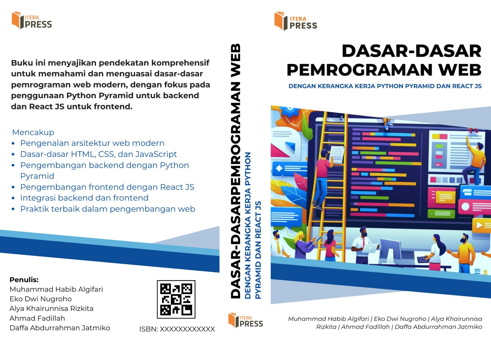

# Dasar-Dasar Pemrograman Web
## Dengan Kerangka Kerja Python Pyramid dan React Js

## 📚 Author

<table border="1" style="width: 100%; border-collapse: collapse; margin-bottom: 20px;">
  <thead style="background-color: #f4f4f4;">
    <tr>
      <th style="padding: 12px; text-align: left;">Foto</th>
      <th style="padding: 12px; text-align: left;">Nama</th>
      <th style="padding: 12px; text-align: left;">Posisi</th>
    </tr>
  </thead>
  <tbody>
    <tr style="border-bottom: 1px solid #ddd; transition: background-color 0.3s;">
      <td style="padding: 12px; text-align: center;">
        
      </td>
      <td style="padding: 12px; font-weight: bold; color: #333;">Muhammad Habib Algifari</td>
      <td style="padding: 12px; color: #666;">Dosen Informatika ITERA</td>
    </tr>
    <tr style="border-bottom: 1px solid #ddd; transition: background-color 0.3s;">
      <td style="padding: 12px; text-align: center;">
        
      </td>
      <td style="padding: 12px; font-weight: bold; color: #333;">Eko Dwi Nugroho</td>
      <td style="padding: 12px; color: #666;">Dosen Informatika ITERA</td>
    </tr>
    <tr style="border-bottom: 1px solid #ddd; transition: background-color 0.3s;">
      <td style="padding: 12px; text-align: center;">
        
      </td>
      <td style="padding: 12px; font-weight: bold; color: #333;">Alya Khairunnisa Rizkita</td>
      <td style="padding: 12px; color: #666;">Asisten Dosen Informatika ITERA</td>
    </tr>
    <tr style="border-bottom: 1px solid #ddd; transition: background-color 0.3s;">
      <td style="padding: 12px; text-align: center;">
        
      </td>
      <td style="padding: 12px; font-weight: bold; color: #333;">Ahmad Fadillah</td>
      <td style="padding: 12px; color: #666;">Mahasiswa Informatika ITERA</td>
    </tr>
    <tr style="border-bottom: 1px solid #ddd; transition: background-color 0.3s;">
      <td style="padding: 12px; text-align: center;">
        
      </td>
      <td style="padding: 12px; font-weight: bold; color: #333;">Daffa Abdurrahman Jatmiko</td>
      <td style="padding: 12px; color: #666;">Mahasiswa Informatika ITERA</td>
    </tr>
  </tbody>
</table>

---
## 🎯 Target Audiens

- 🎓 Mahasiswa Informatika
- 💼 Siswa SMK Rekayasa Perangkat Lunak
- 👨‍🏫 Dosen Informatika

---
## 📖 Tentang Buku



Panduan komprehensif untuk pemrograman web ini menggabungkan konsep dasar dengan aplikasi praktis menggunakan Python Pyramid dan React.js. Ditulis oleh pendidik berpengalaman dan praktisi industri, buku ini menjembatani kesenjangan antara teori dan pengembangan di dunia nyata.

---
## 📂 Daftar Isi

- 📑 1. Bagaimana Aplikasi Web Bekerja?
- 📑 2. Mengenal HTML
- 📑 3. Mengenal CSS
- 📑 4. Tabel, Formulir, Layout dan Web Media
- 📑 5. Pemrograman Javascript
- 📑 6. The Next Generation Javascript
- 📑 7. Bekerja Dengan Framework React Js
- 📑 8. Pemrograman Python
- 📑 9. Object Oriented Programming di Python
- 📑 10. Bekerja dengan Framework Python Pyramid
- 📑 11. Bekerja dengan Basis Data PostgreSQL
- 📑 12. Membuat Aplikasi Pendataan Stunting
- 📑 13. Implementasi Web di sisi Server
- 📑 14. Implementasi Web di Sisi Client

---
## ✨ Fitur Utama

- 14 bab mendetail yang mencakup dasar-dasar web hingga konsep lanjutan
- Contoh praktis dan latihan yang aplikatif
- Panduan lengkap implementasi proyek
- Integrasi framework pengembangan web modern
- Praktik terbaik untuk pengembangan full-stack

1. **Cakupan Komprehensif** - Dari dasar hingga konsep lanjutan
2. **Pendekatan Praktis** - Contoh dunia nyata dan studi kasus
3. **Teknologi Modern** - Menggunakan teknologi terkini seperti Python Pyramid dan React.js
4. **Praktik Terbaik** - Pedoman koding standar industri
5. **Proyek Lengkap** - Pengembangan aplikasi dari awal hingga akhir

---

## 💻 Prasyarat

- Python 3.7 
- Node.js 20.9.0 dan npm 10.8.1
- Text Editor
- Pemahaman dasar tentang konsep algoritma pemrogramman
  
---

## 💻 Tech Stack

- **Frontend**: React.js 18.0, HTML5, CSS3, JavaScript (ES6+)
- **Backend**: Python Pyramid 2.0
- **Database**: PostgreSQL 13.0
- **Tools**: Git 2.30, VSCode 1.60
  
---

## 🏆 Dukungan

Karya ini didukung oleh Hibah Buku Keilmuan ITERA tahun 2023

---

## 📚 Happy Learning! 

```
  _    _                           ____          _ _             _ 
 | |  | |                         / ___|___   __| (_)_ __   __ _| |
 | |__| | __ _ _ __  _ __  _   _| |   / _ \ / _` | | '_ \ / _` | |
 |  __  |/ _` | '_ \| '_ \| | | | |__| (_) | (_| | | | | | (_| |_|
 |_|  |_|\__,_|_|  \|_|  |_| |_|\____\___/ \__,_|_|_| |_|\__, (_)
                                                          |___/    
```

© 2024 Institut Teknologi Sumatera. All rights reserved.
